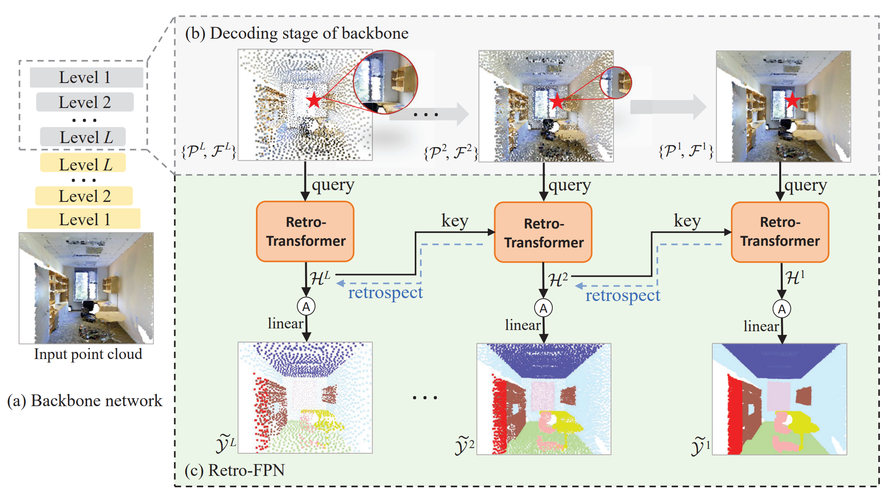

# Retro-FPN: Retrospective Feature Pyramid Network for Point Cloud Semantic Segmentation (ICCV 2023)

[Peng Xiang*](https://scholar.google.com/citations?user=Bp-ceOAAAAAJ&hl=zh-CN&oi=sra), [Xin Wen*](https://scholar.google.com/citations?user=7gcGzs8AAAAJ&hl=zh-CN&oi=sra), [Yu-Shen Liu](http://cgcad.thss.tsinghua.edu.cn/liuyushen/), [Hui Zhang](https://www.thss.tsinghua.edu.cn/en/faculty/huizhang.htm), [Yi Fang](https://scholar.google.com/citations?user=j-cyhzwAAAAJ&hl=en), [Zhizhong Han](https://h312h.github.io/)

[](pics/retrofpn.jpg)

## [Retro-FPN]

**Retro-FPN: Retrospective Feature Pyramid Network for Point Cloud Semantic Segmentation**

> Learning per-point semantic features from the hierarchical feature pyramid is essential for point cloud semantic segmentation. However, most previous methods suffered from ambiguous region features or failed to refine per-point features effectively, which leads to information loss and ambiguous semantic identification. To resolve this, we propose Retro-FPN to model the per-point feature prediction as an explicit and retrospective refining process, which goes through all the pyramid layers to extract semantic features explicitly for each point. Its key novelty is a retro-transformer for summarizing semantic contexts from the previous layer and accordingly refining the features in the current stage. In this way, the categorization of each point is conditioned on its local semantic pattern. Specifically, the retro-transformer consists of a local cross-attention block and a semantic gate unit. The cross-attention serves to summarize the semantic pattern retrospectively from the previous layer. And the gate unit carefully incorporates the summarized contexts and refines the current semantic features. Retro-FPN is a pluggable neural network that applies to hierarchical decoders. By integrating Retro-FPN with three representative backbones, including both point-based and voxel-based methods, we show that Retro-FPN can significantly improve performance over state-of-the-art backbones. Comprehensive experiments on widely used benchmarks can justify the effectiveness of our design.

## [Cite this work]

```
@InProceedings{xp_retrofpn_2023,
    author    = {Xiang, Peng and Wen, Xin and Liu, Yu-Shen and Zhang, Hui and Fang, Yi and Han, Zhizhong},
    title     = {Retro-FPN: Retrospective Feature Pyramid Network for Point Cloud Semantic Segmentation},
    booktitle = {Proceedings of the IEEE/CVF International Conference on Computer Vision (ICCV)},
    month     = {October},
    year      = {2023},
    pages     = {17826-17838}
}

```

## Acknowledgements

Some of the code of this repo is borrowed from: 
- [Point Transformer](https://github.com/POSTECH-CVLab/point-transformer)
- [Point Transformer V2](https://github.com/POSTECH-CVLab/point-transformer)
- [BPNet](https://github.com/wbhu/BPNet)
- [MinkowskiNet](https://github.com/NVIDIA/MinkowskiEngine/tree/master)


We thank the authors for their great job!

## License

This project is open sourced under MIT license.